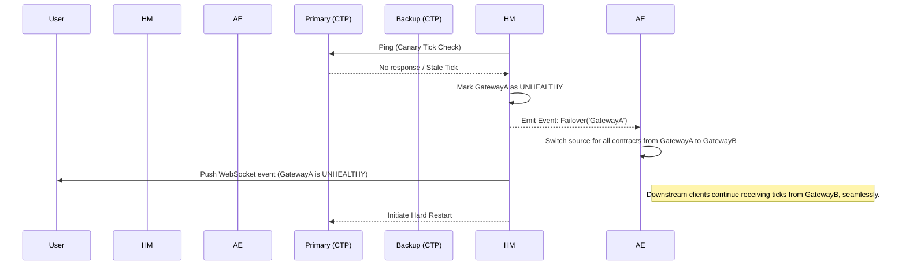

### **6. Core Workflows**

#### **Automated Failover Sequence**

This diagram illustrates how the system handles a failure in the primary data source.

```mermaid
sequenceDiagram
    participant User
    participant HealthMonitor as HM
    participant AggregationEngine as AE
    participant GatewayA as Primary (CTP)
    participant GatewayB as Backup (CTP)

    HM->>GatewayA: Ping (Canary Tick Check)
    GatewayA-->>HM: No response / Stale Tick

    HM->>HM: Mark GatewayA as UNHEALTHY
    HM-->>AE: Emit Event: Failover('GatewayA')

    AE->>AE: Switch source for all contracts from GatewayA to GatewayB

    HM->>User: Push WebSocket event (GatewayA is UNHEALTHY)

    Note right of AE: Downstream clients continue receiving ticks from GatewayB, seamlessly.

    HM-->>GatewayA: Initiate Hard Restart
```
