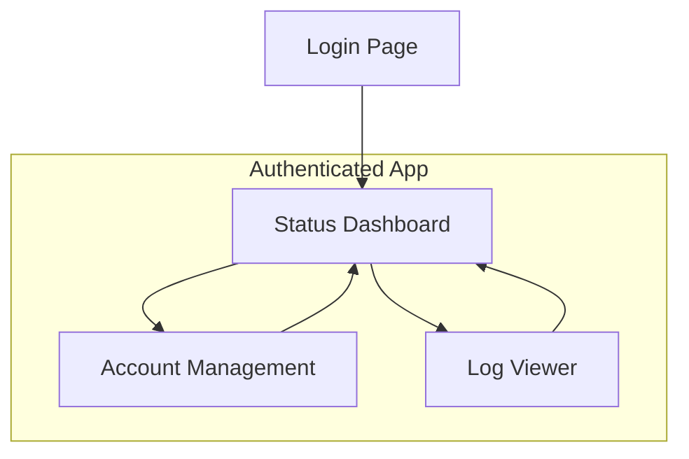

### **Front-End Specification: Local High-Availability Market Data Hub**

**Version**: 1.0
**Date**: June 22, 2025
**Author**: Sally, UX Expert

### **1. Overall UX Goals & Principles**

#### **Target User Personas**

  * Our primary user is the **Internal Quantitative Developer/Researcher**. This user is highly tech-savvy, values efficiency and data integrity, and is likely managing multiple complex systems simultaneously. They prefer information density and clear controls over decorative UI elements.

#### **Usability Goals**

  * **Clarity:** The user must be able to understand the health of the entire system within 5 seconds of looking at the dashboard.
  * **Efficiency:** Critical actions, like restarting a problematic gateway, should require no more than two clicks.
  * **Confidence:** The interface must provide clear, immediate feedback for every action, so the user feels in complete control and trusts the system's state.

#### **Design Principles**

1.  **Data-First, Not Decorative**: Every pixel on the screen should serve a purpose, primarily to convey information or enable an action. We will avoid purely aesthetic elements.
2.  **Clarity at a Glance**: We will use a strong visual hierarchy, clear color-coding (e.g., green for healthy, red for error), and uncluttered layouts to make the system status instantly understandable.
3.  **Control with Confidence**: Every interactive element will have clear states (hover, active, disabled) and every user action will result in immediate and unambiguous feedback.
4.  **Consistency is Key**: We will strictly adhere to the `Shadcn/ui` component library and our defined dark theme to ensure a predictable and easy-to-learn interface.

### **2. Information Architecture (IA)**

The application will be a single-page application (SPA) with a simple, clear navigation structure.

#### **Site Map**



#### **Navigation Structure**

  * **Primary Navigation**: A persistent sidebar on the left will contain links to the three core views: Status Dashboard, Account Management, and Log Viewer.
  * **User/Auth Navigation**: A small user profile dropdown at the top-right of the header will contain a "Logout" button.

### **3. User Flows**

#### **Flow 1: Monitor System Health**

  * **User Goal**: To quickly assess the health of all active data sources.
  * **Flow Diagram**:
    ```mermaid
    graph TD
        A[User opens browser] --> B[Navigates to App URL];
        B --> C{Authenticated?};
        C -->|No| D[Redirect to Login Page];
        D --> E[User enters credentials];
        E --> C;
        C -->|Yes| F[Display Status Dashboard];
        F --> G[User sees all gateways are green];
        G --> H[User feels confident];
    ```

#### **Flow 2: Intervene in a Failure**

  * **User Goal**: To diagnose and resolve a failed gateway connection.
  * **Flow Diagram**:
    ```mermaid
     graph TD
        A[User views Status Dashboard] --> B[Notices one gateway is red (UNHEALTHY)];
        B --> C[Hovers over status to see error tooltip];
        C --> D[Clicks on 'Log Viewer' in sidebar];
        D --> E[Filters logs by 'ERROR' and gateway ID];
        E --> F[Identifies root cause from logs];
        F --> G[Navigates back to Status Dashboard];
        G --> H[Clicks 'Hard Restart' button for the failed gateway];
        H --> I[UI shows gateway status as 'CONNECTING'];
        I --> J[Gateway status turns green (HEALTHY)];
    ```

### **4. Wireframes & Mockups**

High-fidelity mockups and interactive prototypes should be created in Figma. The following is a low-fidelity textual wireframe for the main **Status Dashboard** to guide the design.

**Low-Fidelity Wireframe: Status Dashboard**

```
+----------------------------------------------------------------------+
| [HEADER: App Title]                          [User: admin | Logout] |
+----------------------------------------------------------------------+
| [S] | [CONTENT AREA]                                               |
| [I] |                                                              |
| [D] | [SECTION: Canary Contracts]                                  |
| [E] |   +-----------------+  +-----------------+                     |
| [B] |   | IF2509 (HEALTHY) | | m2509 (HEALTHY)  | ...                |
| [A] |   | Last: 15:30:01   | | Last: 15:30:00   |                     |
| [R] |   +-----------------+  +-----------------+                     |
|     |                                                              |
|     | [SECTION: Gateway Status]                                    |
|     |   +----------------------------------------------------------+ |
|     |   | ID | Status | Type | Priority | Uptime | Actions         | |
|     |   +----------------------------------------------------------+ |
|     |   | ctp_main | [G] | CTP  | 1        | 6h 15m | [Restart][Stop] | |
|     |   | ctp_back | [G] | CTP  | 2        | 6h 15m | [Restart][Stop] | |
|     |   | sopt_main| [R] | SOPT | 1        | 2m 05s | [Restart][Stop] | |
|     |   +----------------------------------------------------------+ |
|     |                                                              |
+----------------------------------------------------------------------+
```

*Key: [G] = Green Status, [R] = Red Status*

### **5. Component Library / Design System**

We will exclusively use **Shadcn/ui** built on top of Tailwind CSS. This ensures consistency and leverages a modern, utility-first approach. We will not create custom one-off components where a Shadcn/ui equivalent exists.

**Core Components to be Used:**

  * **Card**: For displaying individual gateway status and canary contract info.
  * **Table**: For the detailed view on the Account Management page.
  * **Button**: For all actions (Restart, Stop, Save, etc.).
  * **Badge**: To display status labels (e.g., "HEALTHY", "UNHEALTHY").
  * **Switch**: For enabling/disabling accounts on the Account Management page.
  * **Dropdown Menu**: For the user logout menu.
  * **Input**: For the login form and any future configuration forms.
  * **Tooltip**: To show detailed error messages on hover.

### **6. Branding & Style Guide**

  * **Theme**: Dark mode by default.
  * **Font**: System default sans-serif font stack for maximum readability and performance (Inter, -apple-system, BlinkMacSystemFont, "Segoe UI", Roboto).
  * **Color Palette (Draft)**:
      * `background`: Near-black gray (e.g., `#111827`)
      * `foreground`: Light gray (e.g., `#E5E7EB`)
      * `primary/accent`: Bright blue (e.g., `#3B82F6`)
      * `status-green`: Vibrant green (e.g., `#22C55E`)
      * `status-yellow`: Amber/Yellow (e.g., `#F59E0B`)
      * `status-red`: Strong red (e.g., `#EF4444`)
      * `border/card`: Darker gray (e.g., `#1F2937`)

### **7. Accessibility Requirements**

  * **Compliance Target**: WCAG 2.1 Level A.
  * **Visual**: All text must have a minimum contrast ratio of 4.5:1 against its background.
  * **Interaction**: All interactive elements (buttons, switches, links) must have a clear and visible focus state and be fully operable via keyboard (tabbing, enter, spacebar).
  * **Content**: All icons used as buttons must have appropriate `aria-label` attributes for screen readers.

### **8. Responsiveness Strategy**

  * **Primary Target**: Desktop (screens \> 1024px).
  * **Secondary Target**: Tablet (screens \< 1024px).
  * **Layout Adaptation**: The multi-column layout of the dashboard (e.g., multiple gateway cards side-by-side) will collapse into a single, scrollable column on smaller screens. The sidebar may be hidden behind a "hamburger" menu icon on smaller screens.

### **9. Animation & Micro-interactions**

Animations will be minimal and purposeful. We will use subtle transitions for state changes (e.g., a button's background color on hover) and loading spinners, but avoid complex or distracting animations.

### **10. Performance Considerations**

  * **Loading**: Leverage Next.js's automatic code-splitting per route.
  * **Data**: The WebSocket connection should be the primary source of live data to avoid polling. The initial page load should be fast, with data populating as it streams in.
  * **Bundle Size**: We will monitor the client-side bundle size to ensure a fast initial load time.