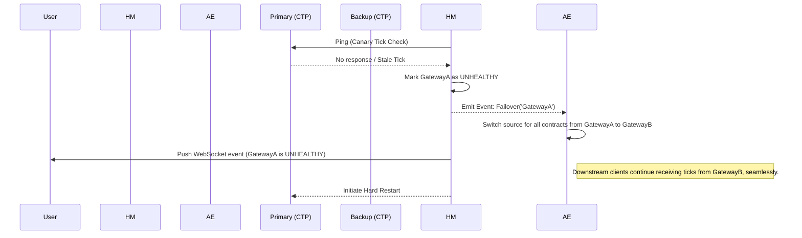

Understood. Activating YOLO mode.

As Winston, the Architect, I have synthesized the Project Brief, PRD, and Front-End Specification to generate the comprehensive technical blueprint for the project. This document will serve as the single source of truth for all development work.

Please review the following complete `fullstack-architecture.md` draft.

---

### **Fullstack Architecture: Local High-Availability Market Data Hub**

**Version**: 1.0
**Date**: June 22, 2025
**Author**: Winston, Architect

### **1. Introduction**

This document outlines the complete fullstack architecture for the Local High-Availability Market Data Hub. It provides a detailed technical blueprint for the backend services, frontend dashboard, and their integration, ensuring a consistent and robust implementation that aligns with the project's requirements for performance, stability, and scalability.

- **Starter Template**: While a specific starter template was not designated, this architecture follows the conventions of a modern fullstack application built with **Next.js** within a **Turborepo/Nx-style Monorepo**. This approach is chosen to facilitate code sharing and streamlined build processes.
- **Source Documents**: This architecture is derived from the approved `project_brief.md`, `prd.md`, and `front-end-spec.md`.

### **2. High-Level Architecture**

#### **2.1. Technical Summary**

The system is designed as a **Modular Monolith** backend service, containerized with Docker, responsible for data aggregation and distribution. It is paired with a modern **Next.js** frontend dashboard for management and monitoring. The backend, built with Python and FastAPI, will handle connections to multiple CTP and SOPT gateways, perform real-time health checks, and execute automated failovers. A hybrid **REST API and WebSocket** interface facilitates communication between the frontend and backend, while a **ZeroMQ** message bus handles the high-throughput distribution of cleansed `TickData` to internal strategy clients.

#### **2.2. Platform and Infrastructure**

- **Platform**: The entire system will be deployed on a dedicated **Ubuntu 24.04** server.
- **Deployment Model**:
  - **Backend & Databases**: Deployed as a set of coordinated **Docker containers** managed via `docker-compose`. This ensures environment consistency and simplifies dependency management.
  - **Frontend**: The Next.js web dashboard will be containerized and deployed locally alongside the backend services using Docker Compose.
- **Repository Structure**: A **Monorepo** structure will be used to manage all code (backend, frontend, shared types) in a single Git repository.

#### **2.3. High-Level Architecture Diagram**

This C4-style container diagram illustrates the primary components and their interactions.

```mermaid
graph TD
    subgraph "User's Workstation"
        user[Quantitative Developer<br/>[Person]]
    end

    subgraph "Local Docker Network"
        dashboard[Web Dashboard<br/>[Container: Next.js]]
    end

    subgraph "Ubuntu 24.04 Server (Docker)"
        subgraph "Market Data Hub Service"
            api[API & WebSocket<br/>[Component: FastAPI]]
            aggregator[Aggregation & Failover Engine<br/>[Component: Python]]
            monitor[Health Monitor<br/>[Component: Python]]
            zmq[Data Distribution Hub<br/>[Component: ZeroMQ PUB]]
        end

        db[(Database<br/>[Container: MySQL/Mongo])]
    end

    subgraph "External Exchanges"
        ctp_gw[CTP Gateway API]
        sopt_gw[SOPT Gateway API]
    end

    user -- "Manages & Monitors via HTTPS" --> dashboard
    dashboard -- "REST API Calls / WebSocket<br/>[HTTPS]" --> api
    api -- "Controls & Reads from" --> aggregator
    api -- "Reads State from" --> monitor
    aggregator -- "Receives Data from" --> ctp_gw
    aggregator -- "Receives Data from" --> sopt_gw
    monitor -- "Monitors Gateways in" --> aggregator
    aggregator -- "Stores/Reads Config from" --> db
    aggregator -- "Publishes Ticks to" --> zmq
```

#### **2.4. Architectural Patterns**

- **Modular Monolith**: The backend service runs in a single process but is internally structured into loosely-coupled modules (data access, aggregation, monitoring) to facilitate maintenance and future scalability.
- **Repository Pattern**: The backend will use this pattern to abstract database interactions, allowing for flexible support of both MySQL and MongoDB.
- **Event-Driven**: The internal `vnpy` core operates on an event-driven model, which we will extend for inter-module communication within the backend.
- **Publish/Subscribe**: ZeroMQ will be used for a high-performance, one-to-many distribution of tick data to subscribing clients.

### **3. Tech Stack**

This table represents the single source of truth for technologies and versions to be used in the project.

| Category               | Technology            | Version | Rationale                                         |
| :--------------------- | :-------------------- | :------ | :------------------------------------------------ |
| **Backend Language**   | Python                | 3.12    | Performance improvements and stability.           |
| **Backend Framework**  | FastAPI               | Latest  | High-performance, async support, auto-docs.       |
| **Frontend Framework** | Next.js               | Latest  | First-class React framework with SSG/SSR.         |
| **Frontend Language**  | TypeScript            | Latest  | Type safety for robust frontend code.             |
| **UI Component Lib**   | Shadcn/ui             | Latest  | Consistent, accessible, and modern UI components. |
| **Database**           | MySQL / MongoDB       | Latest  | Flexible support for relational and NoSQL stores. |
| **Core Trading Lib**   | vnpy                  | 4.1.0   | Pinned version for stability.                     |
| **CTP Adapter**        | vnpy_ctp              | 6.7.7.2 | Pinned version for stability.                     |
| **SOPT Adapter**       | vnpy_sopt             | 3.7.1.0 | Pinned version for stability.                     |
| **Deployment**         | Docker                | Latest  | Containerization for consistency and isolation.   |
| **Data Distribution**  | ZeroMQ (pyzmq)        | Latest  | High-speed, low-latency messaging.                |
| **Communication**      | REST API & WebSockets | N/A     | Hybrid model for control and real-time updates.   |

### **4. Data Models**

The primary data model for configuration is the `MarketDataAccount`. It will be represented by the following structure, which can be mapped to both SQL and NoSQL databases.

```typescript
// Located in packages/shared/types.ts
export interface MarketDataAccount {
  id: string; // Unique identifier (e.g., 'ctp_main_account')
  gateway_type: "ctp" | "sopt";
  settings: {
    // vnpy gateway settings object
    userID?: string;
    password?: string;
    brokerID?: string;
    mdAddress?: string;
    tdAddress?: string;
    // ... other settings for SOPT etc.
  };
  priority: number; // Lower is higher priority (e.g., 1 is primary)
  is_enabled: boolean; // Whether the service should use this account
  description?: string; // Optional user-friendly name
}
```

### **5. API Specification (REST)**

The backend will expose a REST API for management. The core endpoints are defined below.

```yaml
openapi: 3.0.0
info:
  title: Market Data Hub Management API
  version: 1.0.0
paths:
  /api/accounts:
    get:
      summary: List all configured accounts
      responses:
        "200":
          description: A list of MarketDataAccount objects.
    post:
      summary: Create a new account
      responses:
        "201":
          description: The newly created account.
  /api/accounts/{accountId}:
    put:
      summary: Update an existing account
      parameters:
        - name: accountId
          in: path
          required: true
          schema:
            type: string
      responses:
        "200":
          description: The updated account.
  /api/accounts/{accountId}/{action}:
    post:
      summary: Perform an action on a gateway
      parameters:
        - name: accountId
          in: path
          required: true
        - name: action
          in: path
          required: true
          schema:
            type: string
            enum: [start, stop, restart]
      responses:
        "202":
          description: Action accepted.
```

### **6. Core Workflows**

#### **Automated Failover Sequence**

This diagram illustrates how the system handles a failure in the primary data source.



### **7. Database Schema**

For a SQL implementation (MySQL), the `accounts` table will be structured as follows:

```sql
CREATE TABLE market_data_accounts (
    id VARCHAR(255) PRIMARY KEY,
    gateway_type VARCHAR(50) NOT NULL,
    settings JSON NOT NULL,
    priority INT NOT NULL DEFAULT 2,
    is_enabled BOOLEAN NOT NULL DEFAULT FALSE,
    description TEXT,
    created_at TIMESTAMP DEFAULT CURRENT_TIMESTAMP,
    updated_at TIMESTAMP DEFAULT CURRENT_TIMESTAMP ON UPDATE CURRENT_TIMESTAMP
);
```

### **8. Unified Project Structure (Monorepo)**

```
/
├── apps/
│   ├── api/          # Python/FastAPI Backend Service
│   └── web/          # Next.js Frontend Dashboard
├── packages/
│   ├── shared-types/ # Shared TypeScript interfaces (e.g., MarketDataAccount)
│   └── ui/           # (Optional) Shared React components
├── docker-compose.yml # For local development environment
├── package.json       # Root package.json for monorepo scripts
└── turborepo.json     # Monorepo configuration
```

### **9. Deployment Architecture**

- **Backend**: The `apps/api` service will be packaged into a Docker image via a `Dockerfile`. This image, along with database containers, will be defined in a `docker-compose.prod.yml` file to be run on the Ubuntu host.
- **Frontend**: The `apps/web` application will be containerized with Docker and deployed locally. GitHub Actions CI/CD will handle testing, building, and packaging Docker images for local deployment.
- **Scheduling**: A `cron` job on the Ubuntu host will execute `docker-compose -f docker-compose.prod.yml up -d` and `down` commands based on the required trading schedule.

### **10. Coding Standards**

- **Type Sharing**: All types shared between the frontend (Next.js/TypeScript) and backend (data models sent over API) MUST be defined in the `packages/shared-types` directory to ensure consistency.
- **Environment Variables**: All sensitive information (API keys, database URIs, passwords) MUST be managed via environment variables and never be hardcoded. A `.env.example` file will be maintained.
- **API Communication**: The frontend must use a dedicated service layer (e.g., API client class) to communicate with the backend, abstracting away the `fetch` or `axios` calls.

### **11. Checklist Results Report**

- This architecture document is comprehensive and directly addresses all requirements from the PRD and other source documents. A full validation against the `architect-checklist` will be performed upon stakeholder review to ensure no gaps exist before development begins.
